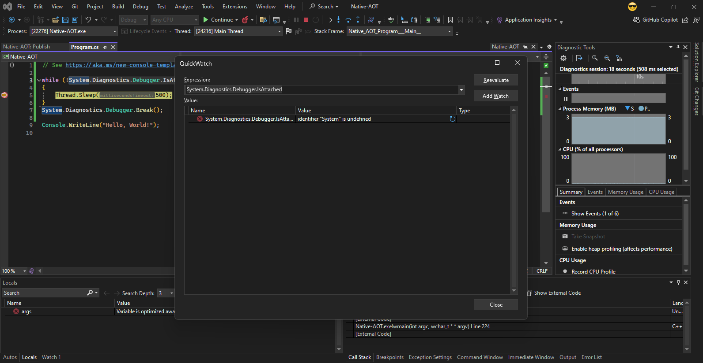

# Native-AOT

#### To test this demo:
- Right-click on the "Native-AOT" project and click on "Publish...".
- Click on the "Publish" button.
- After the publish is finished, click on the "Navigate" link to open publish folder.
- Double click the Native-AOT.exe.
- Click on `Debug->Attach to Process...`.
- Select Local, search for Native-Aot and select it.
- Click on the Attach button.

The `System.Diagnostics.Debugger.Break();`will never be reached.
Put a breakpoint on the line `Thread.Sleep(500);` and the debugger will stop on that line. Clicking on the "Continue" button the debugger will always stop on that line.

Another issue is the debugger showing the `System.Diagnostics.Debugger.IsAttached` expression value as `identifier "System" is undefined` which also will happening with others variables that app may be using.

Stop the debugger and press Ctrl+C to allow the application exit.